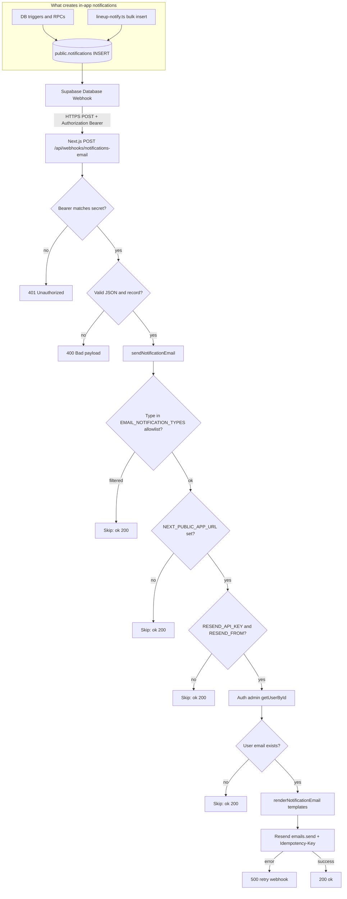
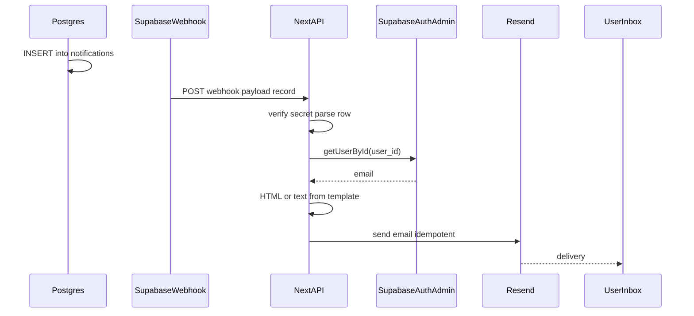

# Email notification flow

Transactional emails mirror rows in `public.notifications`. They are sent when Supabase **Database Webhooks** deliver each **INSERT** to the Next.js API, which calls **Resend**.

## Requirements

- Webhook URL must be **public HTTPS** (e.g. production domain). Supabase Cloud cannot POST to `http://localhost`.
- Env on the Next server: `SUPABASE_NOTIFICATIONS_WEBHOOK_SECRET`, `SUPABASE_SERVICE_ROLE_KEY`, `NEXT_PUBLIC_APP_URL`, `RESEND_API_KEY`, `RESEND_FROM`.

## Flowchart

## Sequence (compact)

## Code map

| Step | Location |
|------|----------|
| Webhook handler | `src/app/api/webhooks/notifications-email/route.ts` |
| Send + Resend | `src/lib/email/send-notification-email.ts` |
| Payload parsing | `src/lib/email/notification-record.ts` |
| Templates | `src/lib/email/templates/render.ts` + `src/lib/email/layout.ts` |
| Auth header check | `src/lib/email/webhook-auth.ts` |
