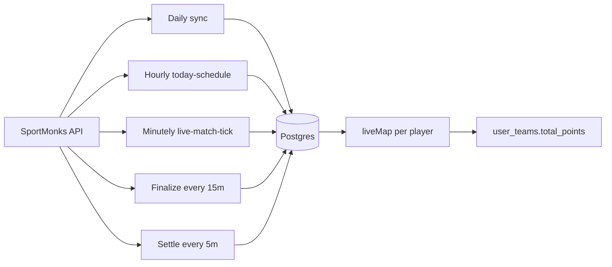

# SportMonks data collection and fantasy scoring pipeline

This document describes **how cricket match data enters Dream12**, **where it is stored**, **which jobs run when**, and **how it becomes fantasy points**. For the **point matrix** (batting, bowling, fielding, SR, economy, captain multipliers), see [dream11-t20-scoring.md](./dream11-t20-scoring.md).

## 1. Overview

Match lifecycle is **state-aware**: `upcoming` → `live` → `in_review` → `completed` (with `scoring_finalized_at`), then contest settlement. The **minutely** job ([`runMatchPipeline`](../src/lib/live-match-tick.ts)) handles prematch toss/lineup, promotes `upcoming`→`live`, and ticks **`live` and `in_review`** until finalize locks scores.

- **SportMonks Cricket API v2.0** — fixture list and `GET /fixtures/:id` with `include` fragments.
- **Persistence** — `matches` row keyed by SportMonks fixture id; JSONB for scoreboard fragments and optional ball snapshot.
- **Normalization** — `extractScoreboardRawToLiveMap` (and fallbacks) build a map keyed by **SportMonks player id** (string).
- **Scoring** — `pointsForPlayer` + starting XI from `players.in_playing_xi` + captain / vice in `aggregateTeamPoints`.

## 2. SportMonks client and environment

| Variable | Purpose |
|----------|---------|
| `SPORTMONKS_API_TOKEN` | Required for any SportMonks call |
| `SPORTMONKS_BASE_URL` | Optional; default `https://cricket.sportmonks.com/api/v2.0` |
| `SPORTMONKS_LEAGUE_ID` / `SPORTMONKS_SEASON_ID` | Filter fixture list during sync |
| `CRON_SECRET` | Bearer auth for cron HTTP routes (never expose to the browser) |

Implementation: [`src/lib/sportmonks/client.ts`](../src/lib/sportmonks/client.ts) (`sportmonksFetch`, `sportmonksToken`).

## 3. Data domains and `include` strings

| Domain | Purpose | Include / notes |
|--------|---------|-------------------|
| Teams | Names, logos, ids | `localteam`, `visitorteam` |
| Venue / stage / league | Metadata | `venue`, `stage`, `league` on list sync |
| Scoreboards | Innings totals, extras | `scoreboards` |
| Runs | Per-innings summary | `runs` |
| Batting | Per-batsman rows | `batting` + nested `batting.batsman`, `batting.wicket`, `batting.catchstump`, `batting.batsmanout`, `batting.runoutby` for fielding and bowled/LBW bonuses |
| Bowling | Per-bowler rows | `bowling` + `bowling.bowler` |
| Balls | Ball-by-ball | `balls` (stored separately from the whitelisted scoreboard JSON; see persistence) |
| Lineup | Playing XI | `lineup` (daily sync + minutely prematch + live tick) |
| Toss | Winner / decision | Cricket v2: fixture root **`toss_won_team_id`**, **`elected`**, and include **`tosswon`** (nested team). Parsed in [`toss.ts`](../src/lib/sportmonks/toss.ts). The legacy include **`toss`** is not used (often **400** on plans). |

List fixtures: `SM_FIXTURE_LIST_INCLUDE` = `localteam,visitorteam,league,venue,stage`.

Lineup-only fetch: `SM_FIXTURE_LINEUP_INCLUDE` = `lineup,localteam,visitorteam,league,venue,stage`.

Prematch (minutely Condition A): `SM_FIXTURE_PREMATCH_INCLUDE` includes **`tosswon`** plus lineup/teams/venue — see [`client.ts`](../src/lib/sportmonks/client.ts) and [`fetchFixturePrematchRaw`](../src/lib/sportmonks/fixture-scoreboard.ts).

Live / scoreboard snapshot: `SM_FIXTURE_SCOREBOARD_INCLUDE` in [`fixture-scoreboard.ts`](../src/lib/sportmonks/fixture-scoreboard.ts) includes **`tosswon`**, `lineup`, nested batting/bowling, `balls`, with **fallback** shorter includes if the API rejects an oversized query.

## 4. Persistence (`matches` table)

| Column | Content |
|--------|---------|
| `fixture_scoreboard_raw` | Whitelisted fragment: teams, `batting`, `bowling`, `runs`, `scoreboards` (see `pickScoreboardRaw`) — **no `balls`** to limit size |
| `fixture_scoreboard_raw_at` | Last write time for the above |
| `fixture_balls_raw` | Last ball-by-ball snapshot from SportMonks (`balls` array) |
| `fixture_balls_raw_at` | Last write time for balls |
| `live_snapshot` | Normalized snapshot for fast UI reads (short line, team totals, optional flattened batting/bowling). Batting rows include synthesized dismissal text when `how_out`/`dismissal` are empty but nested wicket/bowler data exists (see [`normalize-live-snapshot.ts`](../src/lib/sportmonks/normalize-live-snapshot.ts), [`dismissal-format.ts`](../src/lib/sportmonks/dismissal-format.ts)). Scorecard tables cap at **40** rows per innings (`SCORECARD_MAX_ROWS`). |
| `live_snapshot_at` | Last write time |
| `last_lineup_sync_at` | Throttle anchor for applying `lineup` during live tick |
| `lineup_synced` | After XI applied from API; minutely router skips lineup-only polls when true |
| `toss_winner_team_id`, `toss_decision`, `toss_recorded_at`, `toss_raw` | Toss metadata from SportMonks |
| `match_finished_at` | Set when leaving `live` for `in_review` (provider finished) |
| `schedule_checked_at` | Last hourly today-monitor touch |
| `status` | `match_status` enum: `upcoming` \| `live` \| `in_review` \| `completed` |
| `scoring_finalized_at` | Set after final points recompute; required before contest settlement |

Columns `fixture_balls_raw`, `fixture_balls_raw_at`, and `last_lineup_sync_at` are added in [`20260329180000_match_balls_lineup_sync.sql`](../supabase/migrations/20260329180000_match_balls_lineup_sync.sql). Lifecycle + toss columns and `in_review` enum value are in [`20260331120000_match_lifecycle_toss_in_review.sql`](../supabase/migrations/20260331120000_match_lifecycle_toss_in_review.sql).

**Realtime (browser):** `public.matches` is in the `supabase_realtime` publication (see [`20260330120000_realtime_matches.sql`](../supabase/migrations/20260330120000_realtime_matches.sql)). Authenticated clients subscribe via [`useMatchLiveRow`](../src/lib/hooks/use-match-live-row.ts) on match detail, live score, and contest pages so `live_snapshot`, **`fixture_scoreboard_raw`**, and `status` updates from the cron tick stay in sync without a full refresh. The **scorecard** tab prefers rebuilding innings from **`fixture_scoreboard_raw`** via [`buildInningsCardsFromScoreboardRaw`](../src/lib/sportmonks/normalize-live-snapshot.ts) so nested provider fields (wicket, bowler, catchstump, run-out links) are not lost when `live_snapshot` was written earlier; the **summary** tab still uses `live_snapshot` for the headline. RLS on `matches` is `authenticated` only, so signed-out users do not receive these events.

**Fallback includes:** If `SM_FIXTURE_SCOREBOARD_INCLUDE` is rejected and a shorter include is used, nested batting relations may be missing from both `fixture_scoreboard_raw` and dismissal synthesis until a successful rich fetch.

Whitelist: [`src/lib/pick-scoreboard-raw.ts`](../src/lib/pick-scoreboard-raw.ts).

## 5. HTTP routes and cron schedules

Defined in [`vercel.json`](../vercel.json). All cron routes require `Authorization: Bearer <CRON_SECRET>` ([`cron-auth.ts`](../src/lib/cron-auth.ts)).

| Route | Schedule (UTC) | Role |
|-------|----------------|------|
| `GET /api/cron/sync` | `30 20 * * *` | Full SportMonks sync: leagues, seasons, matches, venues, stages, teams, squads, capped lineup pull (does **not** hydrate full scoreboards for every fixture) |
| `GET /api/cron/today-schedule` | `0 * * * *` | Next 24h matches: refresh `start_time`, `sm_fixture_status`, `schedule_checked_at` (does not overwrite lifecycle `status`) |
| `GET /api/cron/live-match-tick` | `* 8-19 * * *` (UTC) | **`runMatchPipeline`**: every minute **only** in those UTC hours (IST ≈ **14:00–01:29** next morning — targets **2pm–1am IST**; first/last hour are full UTC hours so there is a small buffer). Outside that window the route is not invoked by Vercel; use **admin** `POST /api/admin/sync-match` for manual ticks if needed. |
| `GET /api/cron/finalize-scores` | `*/15 * * * *` | **`in_review`** rows with `match_finished_at` older than **60 minutes** (and legacy `completed` without finalize): final fetch, `status`→`completed`, set `scoring_finalized_at` |
| `GET /api/cron/settle-contests` | `*/5 * * * *` | RPC `settle_contest_prizes` when match is `completed` and `scoring_finalized_at` is set |

**Vercel:** cron minimum interval is **one minute**.

**Admin refresh:** `POST /api/admin/sync-match` — body `{ "matchId": <id> }` runs one match tick with lineup force; no body runs **`runMatchPipeline`** (same as minutely cron). [`sync-match/route.ts`](../src/app/api/admin/sync-match/route.ts).

**Recovery / refresh:** `POST /api/admin/backfill-matches` with JSON `limit`, `cursor`, optional `seasonId`, `includeBalls`, `recomputePoints`. Each batch **always** refetches SportMonks and **overwrites** hydrated columns on every selected row (not limited to null scoreboard/snapshot). Also sets **`schedule_checked_at`** on each successful refresh (same idea as hourly today-schedule). If the row is **`live`**, SportMonks maps the fixture to **finished/completed**, and **`match_finished_at`** is still null, backfill sets **`status` → `in_review`** and **`match_finished_at`** (mirrors the live tick). Page with `nextCursor` until `done: true`. For specific fixtures only, send **`matchId`** and/or **`matchIds`** (max 50 unique). Admin session or `Authorization: Bearer CRON_SECRET`. [`backfill-matches.ts`](../src/lib/backfill-matches.ts).

Batching: pipeline processes up to `MAX_MATCHES_PER_RUN` **`live` + `in_review`** rows per minute for the heavy scoreboard path ([`live-match-tick.ts`](../src/lib/live-match-tick.ts)).

## 6. Pipeline by match phase

| Phase | What runs |
|-------|-----------|
| **Upcoming** | Daily sync + squads; minutely **prematch** polls **`lineup`** in the toss window (or after `toss_recorded_at`) until `lineup_synced` |
| **Live** | Minutely: promote via `livescores/now` / meta fixture; full scoreboard fetch + points |
| **In review** | Provider finished: `live`→`in_review`, `match_finished_at` set; minutely **still** updates scoreboard/points until audit buffer elapses |
| **Completed** | Finalize after **60m** buffer: last fetch, `status`→`completed`, `scoring_finalized_at`; then settle contests |

Core modules: [`sync-pipeline.ts`](../src/lib/sportmonks/sync-pipeline.ts), [`live-match-tick.ts`](../src/lib/live-match-tick.ts) (`runMatchPipeline`), [`today-schedule-monitor.ts`](../src/lib/today-schedule-monitor.ts), [`finalize-match-scoring.ts`](../src/lib/finalize-match-scoring.ts), [`toss.ts`](../src/lib/sportmonks/toss.ts).

## 7. Normalization → `liveMap`

1. **`extractScoreboardRawToLiveMap`** ([`extract-scoreboard-raw-to-live-map.ts`](../src/lib/extract-scoreboard-raw-to-live-map.ts)) — walks `batting` and `bowling` arrays (including `{ data: [] }` shape), merges into `Partial<NormalizedPlayerStats>` keyed by SportMonks player id string via `mergeNodeIntoStats` ([`extract-live-stats-by-player.ts`](../src/lib/extract-live-stats-by-player.ts)).

2. **Dismissal / fielding pass** — For dismissed batting rows, uses `wicket.name`, `catchstump` / `catch_stump_player_id`, `bowling_player_id`, `runoutby` / `runout_by_id`, `batsmanout` / `batsmanout_id` to increment `catches`, `stumpings`, `runOutDirect` / `runOutIndirect`, and `bowledLbwDismissals` on the relevant fielders and bowlers.

3. **Fallback** — If the map is empty, [`extractLiveStatsByPlayer`](../src/lib/extract-live-stats-by-player.ts) walks the full merged payload (used in live tick and finalize).

## 8. Lineup and playing XI

- [`sync-lineup.ts`](../src/lib/sportmonks/sync-lineup.ts) — `syncPlayersForMatch` fetches `include=lineup,...`, upserts `players`, sets `in_playing_xi = true` for XI and `false` for others in the pool.
- **Minutely prematch** — [`runMatchPipeline`](../src/lib/live-match-tick.ts) Condition A: `upcoming`, `lineup_synced = false`, start within ~45m (or `toss_recorded_at` set); `fetchFixturePrematchRaw` + `applyLineupFromFixturePayload`; sets `lineup_synced` when XI rows inserted.
- **Live / in_review tick** — When merged scoreboard includes `lineup` and `last_lineup_sync_at` is older than the 3m throttle (or admin `forceLineup`), applies lineup; sets `lineup_synced` on success.

UI: [`hydrate-team-flow.tsx`](../src/components/team-flow/hydrate-team-flow.tsx) uses `in_playing_xi` for green / red style hints.

## 9. Points computation

- **Performance points** — [`src/lib/fantasy/scoring.ts`](../src/lib/fantasy/scoring.ts) `pointsForPlayer` (Dream11-style T20).
- **Starting XI + C/VC** — [`src/lib/live-scoring.ts`](../src/lib/live-scoring.ts) `aggregateTeamPoints` / `teamPointsBreakdown`.
- **Per-contest recompute** — [`update-user-teams-for-match.ts`](../src/lib/update-user-teams-for-match.ts) loads each team’s roster and writes `user_teams.total_points`.

Full rule tables: [dream11-t20-scoring.md](./dream11-t20-scoring.md).

## 10. Edge cases and assumptions

| Topic | Behavior |
|-------|----------|
| **Bowling `wickets`** | Treated as **excluding run-outs** (SportMonks convention). No extra subtraction unless we observe otherwise in production. |
| **Run-out 12 vs 6+6** | One credited fielder id → `runOutDirect`. Two distinct fielder ids (excluding the dismissed batsman) → each gets `runOutIndirect`. |
| **Stumping vs catch** | Wicket name contains “stump” (and not treated as generic catch) → `stumpings` on `catchstump` / `catch_stump_player_id`. |
| **Caught and bowled** | Catch credited to `bowling_player_id` when wicket text indicates caught-and-bowled. |
| **API URL length** | Rich `include` strings may fail; [`fetchFixtureScoreboardRaw`](src/lib/sportmonks/fixture-scoreboard.ts) falls back to shorter includes. |
| **Rate limits** | Respect SportMonks plan limits; keep `MAX_MATCHES_PER_RUN` conservative on Vercel. |

---

**Maintenance:** When you change `include` strings, DB columns, cron paths, or scoring inputs, update this file in the same change.
