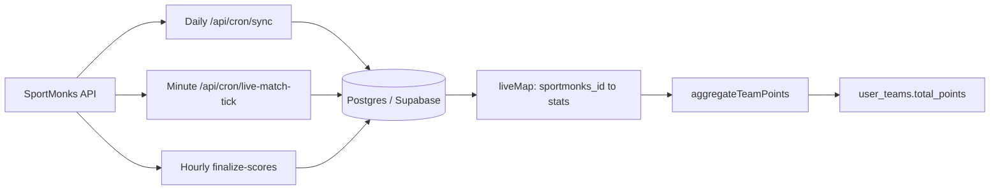

# SportMonks data collection and fantasy scoring pipeline

This document describes **how cricket match data enters Dream12**, **where it is stored**, **which jobs run when**, and **how it becomes fantasy points**. For the **point matrix** (batting, bowling, fielding, SR, economy, captain multipliers), see [dream11-t20-scoring.md](./dream11-t20-scoring.md).

## 1. Overview

- **SportMonks Cricket API v2.0** — fixture list and `GET /fixtures/:id` with `include` fragments.
- **Persistence** — `matches` row keyed by SportMonks fixture id; JSONB for scoreboard fragments and optional ball snapshot.
- **Normalization** — `extractScoreboardRawToLiveMap` (and fallbacks) build a map keyed by **SportMonks player id** (string).
- **Scoring** — `pointsForPlayer` + starting XI from `players.in_playing_xi` + captain / vice in `aggregateTeamPoints`.

## 2. SportMonks client and environment

| Variable | Purpose |
|----------|---------|
| `SPORTMONKS_API_TOKEN` | Required for any SportMonks call |
| `SPORTMONKS_BASE_URL` | Optional; default `https://cricket.sportmonks.com/api/v2.0` |
| `SPORTMONKS_LEAGUE_ID` / `SPORTMONKS_SEASON_ID` | Filter fixture list during sync |
| `CRON_SECRET` | Bearer auth for cron HTTP routes (never expose to the browser) |

Implementation: [`src/lib/sportmonks/client.ts`](../src/lib/sportmonks/client.ts) (`sportmonksFetch`, `sportmonksToken`).

## 3. Data domains and `include` strings

| Domain | Purpose | Include / notes |
|--------|---------|-------------------|
| Teams | Names, logos, ids | `localteam`, `visitorteam` |
| Venue / stage / league | Metadata | `venue`, `stage`, `league` on list sync |
| Scoreboards | Innings totals, extras | `scoreboards` |
| Runs | Per-innings summary | `runs` |
| Batting | Per-batsman rows | `batting` + nested `batting.batsman`, `batting.wicket`, `batting.catchstump`, `batting.batsmanout`, `batting.runoutby` for fielding and bowled/LBW bonuses |
| Bowling | Per-bowler rows | `bowling` + `bowling.bowler` |
| Balls | Ball-by-ball | `balls` (stored separately from the whitelisted scoreboard JSON; see persistence) |
| Lineup | Playing XI | `lineup` (synced on daily job, throttled during live tick) |

List fixtures: `SM_FIXTURE_LIST_INCLUDE` = `localteam,visitorteam,league,venue,stage`.

Lineup-only fetch: `SM_FIXTURE_LINEUP_INCLUDE` = `lineup,localteam,visitorteam,league,venue,stage`.

Live / scoreboard snapshot: `SM_FIXTURE_SCOREBOARD_INCLUDE` in [`fixture-scoreboard.ts`](../src/lib/sportmonks/fixture-scoreboard.ts), with **fallback** shorter includes if the API rejects an oversized query.

## 4. Persistence (`matches` table)

| Column | Content |
|--------|---------|
| `fixture_scoreboard_raw` | Whitelisted fragment: teams, `batting`, `bowling`, `runs`, `scoreboards` (see `pickScoreboardRaw`) — **no `balls`** to limit size |
| `fixture_scoreboard_raw_at` | Last write time for the above |
| `fixture_balls_raw` | Last ball-by-ball snapshot from SportMonks (`balls` array) |
| `fixture_balls_raw_at` | Last write time for balls |
| `live_snapshot` | Normalized snapshot for fast UI reads |
| `live_snapshot_at` | Last write time |
| `last_lineup_sync_at` | Throttle anchor for applying `lineup` during live tick |
| `scoring_finalized_at` | Set after final points recompute for completed matches |

Columns `fixture_balls_raw`, `fixture_balls_raw_at`, and `last_lineup_sync_at` are added in [`supabase/migrations/20260329180000_match_balls_lineup_sync.sql`](../supabase/migrations/20260329180000_match_balls_lineup_sync.sql).

**Realtime (browser):** `public.matches` is in the `supabase_realtime` publication (see [`20260330120000_realtime_matches.sql`](../supabase/migrations/20260330120000_realtime_matches.sql)). Authenticated clients subscribe via [`useMatchLiveRow`](../src/lib/hooks/use-match-live-row.ts) on match detail, live score, and contest pages so `live_snapshot` / `status` updates from the cron tick appear without a full refresh. RLS on `matches` is `authenticated` only, so signed-out users do not receive these events.

Whitelist: [`src/lib/pick-scoreboard-raw.ts`](../src/lib/pick-scoreboard-raw.ts).

## 5. HTTP routes and cron schedules

Defined in [`vercel.json`](../vercel.json). All cron routes require `Authorization: Bearer <CRON_SECRET>` ([`cron-auth.ts`](../src/lib/cron-auth.ts)).

| Route | Schedule (UTC) | Role |
|-------|----------------|------|
| `GET /api/cron/sync` | `30 20 * * *` | Full SportMonks sync: leagues, seasons, matches, venues, stages, teams, squads, capped lineup pull |
| `GET /api/cron/live-match-tick` | `* * * * *` | Live matches: merge `/livescores/now` + fixture detail, persist snapshots, fielding-aware `liveMap`, points, optional lineup + balls |
| `GET /api/cron/finalize-scores` | `15 * * * *` | Completed matches without `scoring_finalized_at`: fetch latest fixture when possible, persist scoreboard/snapshot/balls (same shape as live tick), recompute points, set `scoring_finalized_at` |
| `GET /api/cron/settle-contests` | `45 * * * *` | RPC `settle_contest_prizes` for contests not yet settled |

**Vercel:** cron minimum interval is **one minute**. Sub-minute ball polling requires an external scheduler calling your API or a worker.

**Admin refresh (browser-safe):** `POST /api/admin/sync-match` with an **admin** Supabase session cookie. JSON body `{ "matchId": <fixture id> }` syncs one match (lineup throttle bypassed); omit body to run the same batch as cron (up to `MAX_MATCHES_PER_RUN` live matches). Implementation: [`src/app/api/admin/sync-match/route.ts`](../src/app/api/admin/sync-match/route.ts).

Batching: live tick processes up to `MAX_MATCHES_PER_RUN` live matches per invocation ([`live-match-tick.ts`](../src/lib/live-match-tick.ts)).

## 6. Pipeline by match phase

| Phase | What runs |
|-------|-----------|
| **Upcoming** | Daily sync imports fixture + squads; `syncPlayers` attempts lineup when SportMonks publishes it |
| **Live** | Minute tick: fetch + merge, update `matches`, recompute all `user_teams` for that match via `updateUserTeamsPointsForMatch` |
| **Completed** | `finalize-scores` cron: SportMonks fetch + persist `matches` JSON columns when API succeeds; else fall back to stored scoreboard for `liveMap`; then `scoring_finalized_at`; `settle-contests` distributes prizes when ready |

Core modules: [`sync-pipeline.ts`](../src/lib/sportmonks/sync-pipeline.ts), [`live-match-tick.ts`](../src/lib/live-match-tick.ts), [`finalize-match-scoring.ts`](../src/lib/finalize-match-scoring.ts).

## 7. Normalization → `liveMap`

1. **`extractScoreboardRawToLiveMap`** ([`extract-scoreboard-raw-to-live-map.ts`](../src/lib/extract-scoreboard-raw-to-live-map.ts)) — walks `batting` and `bowling` arrays (including `{ data: [] }` shape), merges into `Partial<NormalizedPlayerStats>` keyed by SportMonks player id string via `mergeNodeIntoStats` ([`extract-live-stats-by-player.ts`](../src/lib/extract-live-stats-by-player.ts)).

2. **Dismissal / fielding pass** — For dismissed batting rows, uses `wicket.name`, `catchstump` / `catch_stump_player_id`, `bowling_player_id`, `runoutby` / `runout_by_id`, `batsmanout` / `batsmanout_id` to increment `catches`, `stumpings`, `runOutDirect` / `runOutIndirect`, and `bowledLbwDismissals` on the relevant fielders and bowlers.

3. **Fallback** — If the map is empty, [`extractLiveStatsByPlayer`](../src/lib/extract-live-stats-by-player.ts) walks the full merged payload (used in live tick and finalize).

## 8. Lineup and playing XI

- [`sync-lineup.ts`](../src/lib/sportmonks/sync-lineup.ts) — `syncPlayersForMatch` fetches `include=lineup,...`, upserts `players`, sets `in_playing_xi = true` for XI and `false` for others in the pool.
- **Live tick** — When the merged fixture includes `lineup` and `last_lineup_sync_at` is older than the throttle window, applies the same DB updates without a second HTTP call.

UI: [`hydrate-team-flow.tsx`](../src/components/team-flow/hydrate-team-flow.tsx) uses `in_playing_xi` for green / red style hints.

## 9. Points computation

- **Performance points** — [`src/lib/fantasy/scoring.ts`](../src/lib/fantasy/scoring.ts) `pointsForPlayer` (Dream11-style T20).
- **Starting XI + C/VC** — [`src/lib/live-scoring.ts`](../src/lib/live-scoring.ts) `aggregateTeamPoints` / `teamPointsBreakdown`.
- **Per-contest recompute** — [`update-user-teams-for-match.ts`](../src/lib/update-user-teams-for-match.ts) loads each team’s roster and writes `user_teams.total_points`.

Full rule tables: [dream11-t20-scoring.md](./dream11-t20-scoring.md).

## 10. Edge cases and assumptions

| Topic | Behavior |
|-------|----------|
| **Bowling `wickets`** | Treated as **excluding run-outs** (SportMonks convention). No extra subtraction unless we observe otherwise in production. |
| **Run-out 12 vs 6+6** | One credited fielder id → `runOutDirect`. Two distinct fielder ids (excluding the dismissed batsman) → each gets `runOutIndirect`. |
| **Stumping vs catch** | Wicket name contains “stump” (and not treated as generic catch) → `stumpings` on `catchstump` / `catch_stump_player_id`. |
| **Caught and bowled** | Catch credited to `bowling_player_id` when wicket text indicates caught-and-bowled. |
| **API URL length** | Rich `include` strings may fail; [`fetchFixtureScoreboardRaw`](src/lib/sportmonks/fixture-scoreboard.ts) falls back to shorter includes. |
| **Rate limits** | Respect SportMonks plan limits; keep `MAX_MATCHES_PER_RUN` conservative on Vercel. |

---

**Maintenance:** When you change `include` strings, DB columns, cron paths, or scoring inputs, update this file in the same change.
